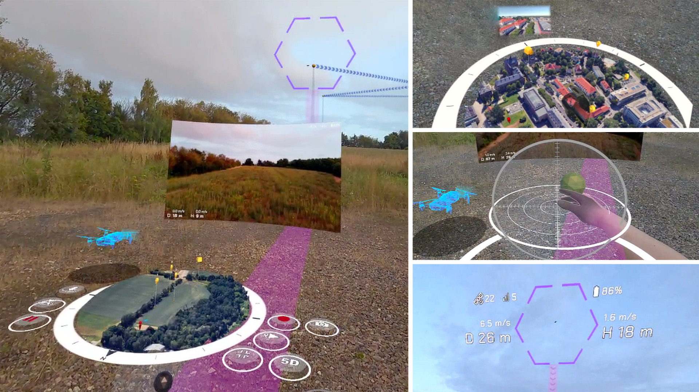

# IGUANA

**IGUANA** is an MR-based interface for UAV guidance, navigation, and control. IGUANA offers (1) high-level control via a 3D map interface, (2) low-level control via a virtual ball interface, and (3) enhanced situational awareness through a spatial overlay.

## Usage
Please visit each sub-project repository:
- [IGUANA Mixed Reality App](https://github.com/PiBu-Labs/IGUANA-MR-App)
- [IGUANA Remote Controller App](https://github.com/PiBu-Labs/IGUANA-RC-App)
- [IGUANA Companion App](https://github.com/PiBu-Labs/IGUANA-Companion-App)

## License
This project is available under [MIT License](LICENSE).

## Disclaimer
This project is provided "as is," without a warranty of any kind, express or implied. See the [LICENSE](LICENSE) file for details.
